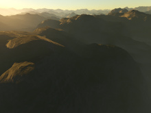
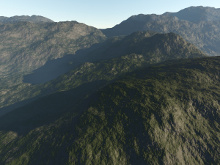
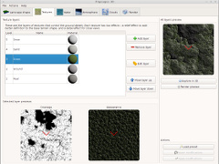

# Paysages 3D

## About

[Paysages 3D](http://www.paysages3d.com) is a work-in-progress landscape generator, modeler and renderer software.

It is written in C++ 11, using Qt 5.4 as only external dependency.

  

## Build/Run

### Using QtSDK (All platforms)

Download and install the latest [QtSDK](http://qt.io/download).

Launch QtCreator, open the project file *src/paysages.pro* and build it.

To run the program, choose the *modeler* target.
To run the unit tests, choose the *tests* target.

### Using a packaged Qt (Linux)

You need at least the 5.4 packaged version of Qt, with qMake and QtCore, QtQuick and QtOpengl modules.

On Ubuntu/Mint:

    sudo apt-get install qt5-qmake libqt5core5a libqt5quick5 libqt5qml5 libqt5opengl5-dev

Then to build and run the software:

    make run

To tun the unit tests, use:

    make tests

## Licensing

The source code is subject to the terms of the [Mozilla Public License, v. 2.0](http://mozilla.org/MPL/2.0/). Read the full terms in the LICENSE file.

## Credits

* [Michaël Lemaire](http://thunderk.net) - Main developer
* [Eric Bruneton and Fabrice Neyet](http://www-evasion.imag.fr/Membres/Eric.Bruneton/) - Publication and source code from *Precomputed Atmospheric Scattering (2008)*
* [Qt](http://qt.io/) - Base framework
* [GoogleTest](https://github.com/google/googletest/) - Used for unit testing
